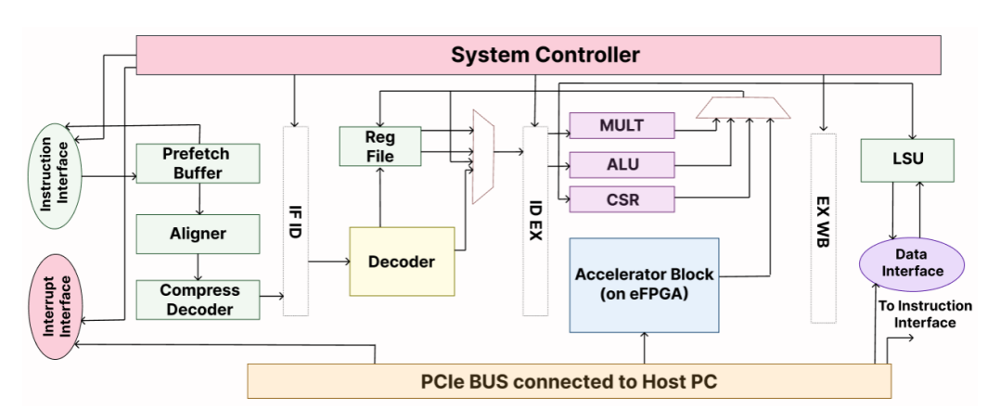
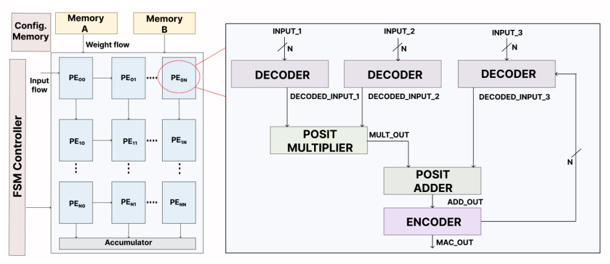
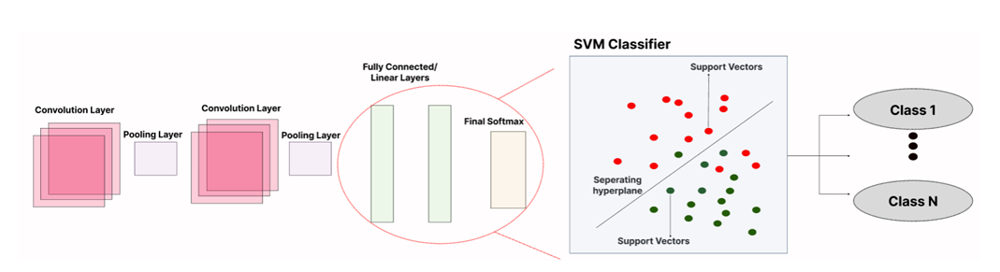
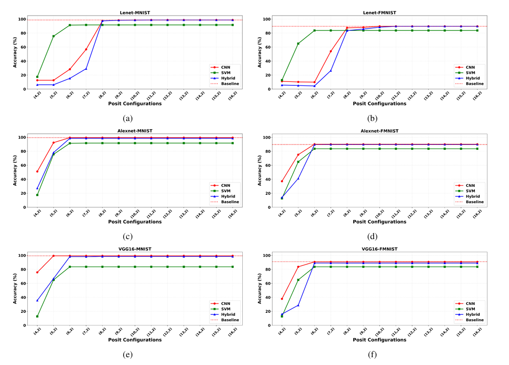
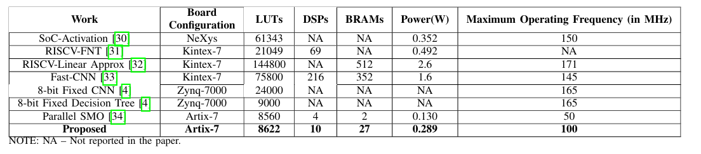

# PoSVM-Net: A Posit-based Hybrid CNN-SVM Architecture for Resource-Constrained Inference

## Overview

Deploying modern Convolutional Neural Networks (CNNs) on resource-constrained edge devices presents a significant challenge due to the high computational and memory overhead associated with conventional FP32 representations and deep fully-connected classification layers. 

**PoSVM-Net** is a hardware-software co-designed architecture that bridges the gap between strict memory constraints and high-fidelity embedded AI inference. By replacing the dense, repeated linear layers of a CNN with a Support Vector Machine (SVM) and executing the workload using a custom Posit-arithmetic systolic array, this project achieves high-accuracy classification with a drastically reduced hardware footprint. 

The system is implemented as a heterogeneous architecture featuring a RISC-V (RI5CY) core tightly coupled with an embedded FPGA (eFPGA) compute engine, optimized and synthesized for the Xilinx Artix-7.

---

## Key Features

* **Hybrid CNN-SVM Pipeline:** Utilizes a frozen CNN backbone for hierarchical feature extraction and a linear SVM for high-margin, low-complexity classification.
* **Mixed-Precision Posit Arithmetic:** Leverages the Posit numerical format with an asymmetrical memory-compute architecture. Weights and features are stored in highly compressed **8-bit Posit** format (cutting memory footprint by 50%), but are dynamically expanded to **16-bit Posit** within the systolic array MAC units to prevent accumulator swamping and preserve predictive accuracy.
* **eFPGA Integration:** The Posit compute engine operates as a custom instruction extension within the execute stage of the RISC-V pipeline, allowing dynamic reconfiguration without off-chip latency penalties.
* **Architectural Acceleration:** Achieves an **18.0x cycle-accurate speedup** over native embedded RISC-V software execution.
* **Ultra-Low Memory Footprint:** The entire SVM weight and feature buffer fits within a deterministic **44 KB** on-chip BRAM allocation.

---

## System Architecture

The hardware architecture is modeled as a heterogeneous system. The RISC-V core is responsible for overall control, instruction decoding, and final argmax post-processing, while the eFPGA fabric accelerates the compute-intensive multiply-accumulate (MAC) operations.

*(Figure 1: Top-level diagram of the proposed architecture highlighting the standard RI5CY blocks alongside the eFPGA based Posit compute engine.)*

### The Posit Compute Engine
The accelerator is designed as a parallel systolic array processing 3 lanes simultaneously. It features custom Posit decoders, Posit multipliers, Posit adders, and encoders. To further optimize logic area, the SVM bias is folded directly into the memory arrays, allowing the hardware to calculate the bias natively inside the MAC loop without requiring a dedicated adder tree at the pipeline's end.

*(Figure 2: Architectural diagram of the proposed Posit systolic array compute engine with a detailed emphasis on the internal architecture of the processing element.)*

---

## Methodology

### 1. Algorithmic Modeling and Data Extraction
The software baseline was established using PyTorch and Scikit-Learn. Models (LeNet, AlexNet, VGG16) were trained on standard datasets (MNIST, Fashion-MNIST, CIFAR-10). The CNN acts as a fixed feature extractor, and the resulting embeddings were used to train a Linear SVM using a One-vs-Rest (OvR) strategy. Weights, biases, and exactly 1,000 validation samples were extracted and converted into C-headers and `.coe` (Memory Initialization) files for hardware testing.

*(Figure 3: Illustration of the hybrid CNN-SVM network and extraction flow.)*

### 2. eFPGA Sweeping and Optimization
Before Vivado implementation, the Posit arithmetic configuration was systematically swept across an eFPGA toolchain (Verilog-to-Routing) varying the bit-width (N) and exponent size (es). This identified the Pareto-optimal hardware configuration that balanced logic utilization against numerical precision.

*(Figure 4: Accuracy Comparison across various Posit Configurations for different models and datasets.)*

---

## Hardware Implementation & Results

The complete architecture was synthesized and implemented targeting the **Xilinx Artix-7 (xc7a200tfbg676-2)** FPGA via Vivado 2023.1. 

### Acceleration Performance
To provide an architecturally sound comparison, acceleration performance was evaluated using cycle-accurate metrics rather than comparing against high-power host CPUs. The software baseline was established using the Spike RISC-V ISA Simulator, executing the inference algorithm natively on the RI5CY core. 

| Execution Platform | Metric | Cycles per Inference | Speedup Factor |
| :--- | :--- | :--- | :--- |
| **Baseline RISC-V (RI5CY)** | Software Execution | 245,940 | 1.0x (Baseline) |
| **Proposed PoSVM-Net (eFPGA)** | Hardware Execution | 13,663 | **18.0x** |

* **Inference Latency:** 136.63 µs (at 100 MHz target frequency)
* **System Throughput:** 7,319 Inferences per Second (IPS)
* **Computational Efficiency:** 0.333 Cycles per MAC operation

### Classification Accuracy
* **Peak Accuracy (VGG16 on MNIST):** 97.10%

### Physical Resource Utilization
The synthesized architecture is highly resource-efficient, making it ideal for deeply constrained edge deployments without relying on external DRAM.

*(Table I: Performance evaluation of the proposed architecture against existing state-of-the-art implementations.)*

| Resource | Utilization | Percentage |
| :--- | :--- | :--- |
| **Look-Up Tables (LUTs)** | 8,622 | ~6.79% |
| **DSPs (DSP48E1)** | 10 | ~1.35% |
| **Block RAM Tiles (BRAM)** | 27 | ~7.30% |
| **Device Static Power** | 0.289 W | N/A |

*Note: The BRAM architecture utilizes a 24-bit bus width (3 parallel lanes × 8-bit Posit), achieving a total architectural memory footprint of strictly 44.02 KB.*

---

### License

This project is licensed under the MIT License - see the LICENSE file for details.